# Frameworks summary

## 1. REST

### 1.1 HTTP refresher

- Client-server protocol
- Transport protocol: TCP on port 80
- Request-response

#### HTTP Request

Request types:

- GET
- POST
- PUT
- DELETE
- HEAD
- OPTIONS

Statuscodes:

- 1xx: Informative
- 2xx: Success
- 3xx: Redirection
- 4xx: Client error
- 5xx: Server error

### 1.2 Rest webservices

REST stands for Representational State Transfer. It's an architectural style used for designing networked applications, especially web services. REST relies on a client-server architecture where the client interacts with the server via requests to access and manipulate resources on the server

- **Client-server**
- **Stateless**: server doesn't store any client context
- **Uniform interface**: independent of type of client
- **Cacheable**: responses from REST service can specify to cache for a specified period. (using the `Cache-Control` header field)
- **Layered system**: client doesn't now which layer it is connected to
- **Code on demand**: Content of message can also be code
- Resource-based: can be any data or service that the app exposes, resources is identifiable via a URI
- CRUD operations: Must support GET, POST, PUT, DELETE methods.
- Representational resources: could be represented by multiple representations (JSON, XML, ...)

#### URI (Uniform Resource Identifier)

URI's are hierarchical structures that represent a resource on which CRUD actions can be performed.

hierarchical: `http://www.myservice.org/discussions/{year}/{day}/{month}/{topic}`

It is also possible to add parameters to the URI to filter or sort on a resources: `http://www.myservice.org/discussions?region=USA&year=2023`

#### Glory of REST


##### Level 0: The swamp of pox

- Plain Old XML (POX)
- One endpoint
- HTTP only as transport
- Remote procedure invocation (`POST <openSlotRequest`)

##### Level 1: Resources

- Multiple endpoints
- Arguments in body (`POST <appointmentRequest`)

##### Level 2: HTTP-methods

- HTTP-methods as CRUD  (`GET ?date=20231224`)
- HTTP-statuscodes as response (`200 OK <openSlotList`)

##### Level 3: Hypermedia controls

- HATEOAS (Hypertext As The Engine Of Application State)
- Links to other resources in response
- Selfdocumenting protocol

### 1.3 Rest webservices: Java (*Springboot*)

**Why springboot?**

Spring avoids a lot of manual configuration and is easy to manage dependently.

#### Spring architecture


1. Spring-framework receives HTTP-req and determines which *method* of which *controller* has to get called.
2. (Opt) Convert JSON in body to specific object
3. (Opt) Validate input values of object
4. Call method of *controller* with object as param
5. *Controller* calls underlying logic
6. Logic interacts with data-layer
7. Result of *controller* gets serialized to JSON
8. HTTP-response gets generated (possibly with JSON-object in body)

#### GET controller

```java
import org.springframework.web.bind.annotation.*;

@RestController // Indicate that this class is a RestController
@RequestMapping("agenda") //The path to access agendas (eg: localhost:8080/agenda)
public class AgendaController {
  private Agenda agenda;
  pubic AgendaController(Agenda agenda) { this.agenda = agenda; }

  @GetMapping // Indicate that method handles Get-requests
  public Collection<AgendaItem> agendaFromNow() {
    return agenda.getAgendaItem(new Date());
  }
}
```

- `@RestController`:
  - Normal class
  - Wrapped in a `servlet` ( a class that handles requests, processes them and reply back with a response)
  - REST-service
- `@RequestMapping`:
  - Specifies which path a REST-service needs to handle.
- `@GetMapping`:
  - Specifies which HTTP-method a method response to
  - Result is automatically converted to JSON
  - Can have a path as parameter (eg `GetMapping("/id/{id}")`)
    - Param can be retrieved using `@RequestParam("id")`
- `@PostMapping`:
  - Body can be retrieved using `@RequestBody AgendaItem item`

##### Dependency injection

DI is needed to make the Agenda class (dependency) available to the to `RestController`.

```java
@Component
public class Agenda {...}
```

##### Method response status

A REST-method typically returns a `ResponseEntity` (along with a message).

```java
@GetMapping("/age")
ResponseEntity<String> age(@RequestParam("yearOfBirth") int yearOfBirth) {
  if (invalidAge(yearOfBirth)) {
    return new ResponseEntity<>("Invalid year of birth", HttpStatus.BAD_REQUEST);
  }
  return new ResponseEntity<>("YOB is " + yearOfBirth, HttpStatus.OK);
}
```

It is also possible to couple a statuscode to an exception:

```java
@ResponseStatus(code = HttpStatus.BAD_REQUEST)
class CustomException extends RuntimeException {}
```

```java
@PostMapping()
@ResponseStatus(HttpStatus.CREATED)
public void storeEmployee(@RequestBody Employee employee) {...}
```

Here the `ResponseStatus` will automatically return a 201 if the creation of employee was successful.

Finally it is also common to respond with a URI.

```java
@PostMapping("/user/{username}")
public ResponseEntity<Void> createTodo(@PathVariable String username, @RequestBody Todo todo) {
  todo.setUsername(username);
  Todo createdTodo = toJpaRepo.save(todo);
  URI uri = ServletUriComponentsBuilder.fromCurrentRequest()
              .path("/id").buildAndExpand(createdTodo.getId()).toUri();
  return ResponseEntity.created(uri).build();
}
```

### 1.4 Testing webservices

#### Unit tests (Junit)

**Fixture**:

- Fixed context
- baseline state

Four phases:

1. Setup: Prepare text fixture
2. Exercise: Interact with system to research
3. Verify: Verify if it behaves as expected
4. Tear down: Break down text fixture to original state

```java
@ExtendWith(SpringExtension.class)
@SpringBootTest(webEnvironment = WebEnvironment.RANDOM_PORT)
@AutoConfigureWebTestClient
@ActiveProfile("test")
class RestAgendaApplicationTest {
  @Autowired
  private WebTestClient webClient;

  @Test
  public void testGetAllRepos() {
    WebTestClient.get().uri("/api/repos")
      .accept(MediaType.APPLICATION_JSON_UTF8)  // Set header
      .exchange()                               // Send message
      .expectStatus().isOk()                    // Check status
      .expectHeader().contentType(MediaType.APPLICATION_JSON_UTF8) // Check header
      .expectedBodyList(Repo.class)             // Check body
  }
}
```

The `@ActiveProfile` annotation is optional but is very useful. It let's us use a different bean configured specifically for testing purposes.

```java
@Component
@Profile("test")
public class DummyDao implements Dao {...}
```

### 1.5 Webservices security

#### Authentication

Configure login information

```java
@Configuration
@EnableWebSecurity
public class SecurityConfig {
  @Bean
  public UserDetailsService userDetailsService(BCryptPasswordEncoder bCryptPasswordEncoder) {
    InMemoryUserDetailsManager manager = new InMemoryUserDetailsManager();
    manager.createUser(User.withUsername("user")
      .password(bCryptPasswordEncoder.encode("userPass"))
      .roles("USER")
      .build());
    manager.createUser(User.withUsername("admin")
      .password(bCryptPasswordEncoder.encode("adminPass"))
      .roles("USER", "ADMIN")
      .build());
    return manager;
  }
...
}
```

#### Authorization

Assign roles to users and restrict certain roles from performing certain actions.


**Allow certain roles webservice:** (`anyRequest()`)

**Allow certain roles on some paths:** (`requestMatchers(path)`)

```java
@Configuration
@EnableWebSecurity
public class SecurityConfig {
  @Bean
  public SecurityFilterChain securityFilterChain(HttpSecurity http) throws Exception {
    http
      .authorizeHttpRequests((authz) -> authz
        .requestMatchers("/api/admin/**").hasRole("ADMIN")
        .requestMatchers("/api/user/**").hasRole("USER")
        .anyRequest().authenticated()
      );
    return http.build();
  }
...
}
```

**Allow certain roles on some webservice methods:** (`@EnableMethodSecurity()`)

```java
@Configuration
@EnableMethodSecurity(prePostEnabled = true, securedEnabled = true, jsr250Enabled = true)
public class SecurityConfig {
  @RolesAllowed("ROLE_VIEWER")
  public String getUser();

  @RolesAllowed({ "ROLE_ADMIN", "ROLE_EDITOR" })
  public void deleteUser();
}
```

##### Request vs method authorization

|                    | Request                | Method |
|------------------- | ---------------------- | --------------- |
| Type               | Rough                  | Detailed |
| Place of config    | In config class        | on specific method |
| Type of config     | With lambda expression | With annotations |
| Definition of auth | In code                | Spring Expression Language |


#### CSRF: Cross Site Request Forgery

CSRF is an attack where an attacker tricks a user's browser into making an unintended and unauthorized request to a different website, exploiting the user's authenticated session.

**How to defend against CSRF?**

Make distinction between real and fake HTTP-request by using a **Synchronizer Token Pattern** or **SameSite-attribute cookie**.

Both methods generate a token for the client on login. Then every time the client interacts with the server, the client includes that token in its request.
On every request, the server will validate if it received a valid token. These tokens have a certain expiration date to avoid problems upon token theft.

> 💡: In Spring, CSRF security is enabled by default.

---

## 2. ORM

### 2.1 ORM: Object Relational Mapping

ORM is a programming technique that allows devs to work with objects in the code while transparently persisting and retrieving data from a relational database.
It allows devs to define how objects/classes map to database tables and vice versa. Each object corresponds to a table in the database.

#### Object-relational impedance mismatch

There are a lot of concepts in OOP that resembles the structure of Relational databases:
    - Identities
    - Relations
    - Inheritance

There are a couple requirements to be able to map an object to a DB.

1. Object must have same *Primary Key* as DB table.
2. Relationships should be the same
3. Each field of the object should map to column in the database

#### ORM in java

Using the *JPA (Java Persistence API)*. Every dataclass must be a Java Bean.

```java
@Entity
@Table(name = "sportclub")
public class Sportclub {
  private Long id;
  private String name;

  @Id
  @GeneratedValue(strategy=GenerationType.IDENTITY)
  public Long getId() { return id; }
  public void setId(Long id) { this.id = id; }

  public String getName() { return name; }
  public void setName(String name) { this.name = name; }
}
```

There are a couple different strategies to assign a new Primary Key:

- AUTO: Automatically choose strategy
- IDENTITY: Relies on an auto-incremented column in the database
- SEQUENCE: Utilizes a database sequence to generate primary key
- TABLE: Requires an extra table to keep track of the next available id

### 2.2 JPA in Spring


#### JPA Repository

The `JpaRepository` is an interface that is a CRUD-repository with extra functionalities for performing database operations.

```java
// Typically defined in a single file (like ProductRepository.java)
public interface ProductRepository extends JpaRepository<Product, Long> {
      List<Product> findByCategory(String category); // Optional custom user-defined queries
}
```

Example usage of build-in queries:

```java
// ProductDao.java
@Service
public class ProductDao{
  private final ProductRepository repo;

  public ProductDao(ProductRepository repository) {
      this.repo = repository;
  }

  public List<Product> getProductsByCategory(String category) {
    return repo.findByCategory(category);
  }

  public Product getProductById(long id) {
    return repo.findById(id).orElse(null);
  }

  public void addProduct(Product p) {
    repo.save(addProduct);
  }
}
```

List of build-in methods:

- `save`: save new object
- `findAll`: return all entities
- `findAllById`: return all with certain id
- `flush`: write changes to DB
- `saveAll`: Save list of objects
- `delete`, `deleteAll`: remove entity/entities
- `existById`: does entity exist?

> ⚠️: Using a JPA requires some configuration in `application.properties`

```text
spring.datasource.url=jdbc:mysql://localhost:3306/dudosdb?serverTimezone=UTC
spring.datasource.username=TLuca
spring.datasource.password=<redacted>
```

### 2.3 ORM Inheritance

There are different annotation to indicate what type of inheritance an object is subject to:

- `@Inheritance(strategy = ...)`: Sets how entities are stored in the DB (default = `SINGLE_TABLE`)
- `@DiscriminatorColumn(name = "...", discriminatorType= ...)`: Defines a column that distinguishes entity types in a single table

Inheritance strategy:

- `@DiscriminatorValue("K")`: Assigns a specific value to differentiate an entity type in a single table inheritance setup
- `@PrimaryKeyJoinColumn(name = "...")`: Maps a parent table's primary key as a foreign key in the child table in joined table inheritance.

### 2.4 ORM associations: value-objects

Associations:

- Direction:
  - Unidirectional
  - Bidirectional
- Multiplicity:
  - 1-to-1
  - 1-to-many
  - many-to-many

Value-objects criteria:

- Value-obj belongs to just one entity
- Entity disappears -> value-object disappears
- An entity has an *identifier*

#### Value-object example


It doesn't make sense to save the value-object (`Address`) in a separate table. So we can store the `Address` in the same table in multiple `Embedded columns`.

We would also like to make an association to a separate table containing all the email addresses.

```java
@Embeddable
public class Address {
    private String street;
    private String city;
    private String state;
    private String zipCode;
    // Getters, setters, constructors, etc.
}

@Entity
@Table(name = "sportclub")
public class sportclub {
  @Id
  private Long id;
  private String name;
  @Embedded
  private Address address;

  @ElementCollection
  @CollectionTable(name = "emailaddresses",
  joinColumns = @JoinColumn(name = "sportclub"))
  @Column(name="email")
}
```

### 2.5 ORM associations: relations

Different mappings of associations of entities:

1. One-to-One Relationship:
    - `@OneToOne`: Defines a one-to-one relationship between two entities.
    - `@JoinColumn`: Specifies the column used for joining two entities in a one-to-one relationship.
2. One-to-Many Relationship:
    - `@OneToMany`: Represents a one-to-many relationship between two entities.
    - `@JoinColumn` (within `@OneToMany`): Specifies the column in the "many" side entity to join with the "one" side entity.
3. Many-to-One Relationship:
    - `@ManyToOne`: Specifies a many-to-one relationship between two entities.
    - `@JoinColumn` (within `@ManyToOne`): Specifies the column in the "many" side entity that references the "one" side entity.
4. Many-to-Many Relationship:
    - `@ManyToMany`: Defines a many-to-many relationship between two entities.
    - `@JoinTable`: Specifies the join table for the many-to-many relationship, defining the columns and their mappings.

For detailed examples of relations (with annotation parameters) see: <https://www.baeldung.com/jpa-hibernate-associations>

### 2.6 How does JPA work?


> ❗: TODO

---

## 3. Node.js

Node.js is a JS runtime environment that runs on the V8 JavaScript engine.

### 3.1 Example HTTP-server in Node.js

```js
let http = require('http');
let fs = require('fs');
let port = process.env.port || 8080;

http.createServer( (req, res) => {
  console.log("Request on port 8080");
  res.writeHead(200, {
    'Content-Type': 'text/html',
    'Access-Control-Allow-Origin': '*'
  });
  let read = fs.createReadStream(__dirname + '/index.html');
  read.pipe(res);
}).listen(port);
```

### 3.2 Routing

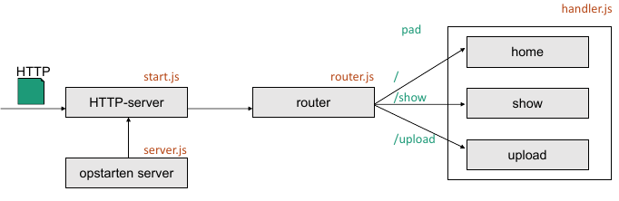

server.js

```js
let server = require('./start');
let router = require('./router');
let requestHandlers = require("./handlers");
let handler = {};

handler["/"] = requestHandlers.home;
handler["/show"] = requestHandlers.show;
handler["/upload"] = requestHandlers.upload;

server.start(router.route, handler);
```

handlers.js

```js
let fs = require('fs');

function home(res) {
  respond(res,'views/home.html');
  return true;
}

function show(response) {...}
function upload(response) {...}
function respond(response, file) {
  fs.readFile(file, (err, data) => {
    response.writeHead(200, {"Content-Type": "text/html"});
    response.write(data);
    response.end();
  });
}
exports.home = home;
exports.show = show;
exports.upload = upload;
```

router.js

```js
function route(pathname, handler, response) {
  console.log("Request for " + pathname);
  if (handler[pathname] !== undefined) {
    return handler[pathname](response);
  } else {
    console.log("No Method found for " + pathname);
    return null;
  }
}
exports.route = route;
```

start.js

```js
let http = require("http");
let url = require("url");

function start(route, handler) {
  console.log("Starting.");
  start.js

  function onRequest(request, response) {
    let pathname = url.parse(request.url).pathname;
    let content = route(pathname, handler, response);
    if (!content) {
      response.writeHead(404, {"Content-Type": "text/plain"});
      response.write("404 Not found");
      response.end();
    }
  }

  let port = process.env.port || 8080;
  http.createServer(onRequest).listen(port);
  console.log("Has been started.");
}

exports.start = start;
```

### 3.3 The Node.js system

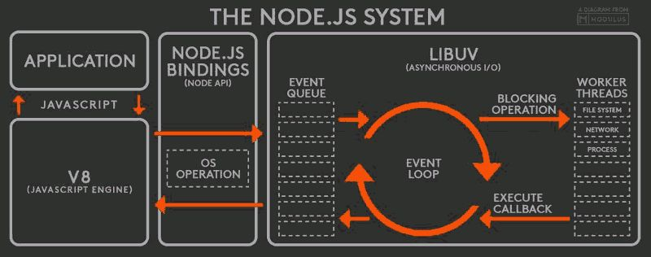

- **Engine**: executes the code
- **Event Loop**: Everything that happens in Node is a reaction to an event. Only one thread executes code, the thread where the event loop is running.
  1. **Timers**: Executes callbacks scheduled by `setTimeout()` or `setInterval()`
  2. **I/O Callbacks**: Handle I/O-related callbacks
  3. **Poll**: Retrieve new I/O events
  4. **Check**: Execute `setImmediate()` callbacks
  5. **Close Callbacks**: Executes close event callbacks (`socket.on('close',...)`)

> ⚠️: Because of Node.js concurrency model, it's important to never block the event loop, instead, use callbacks and asynchronous methods.

### 3.4 Express.js

Express is a framework for Node.js that makes it easier to build RESTful APIs.
A significant part of Express revolves around **middleware**.

**Middleware**
: software component that sits between a client and a server, intercepting and processing HTTP requests and responses. It's a common pattern in web development used to perform various tasks like authentication, logging, request parsing, error handling, and more.

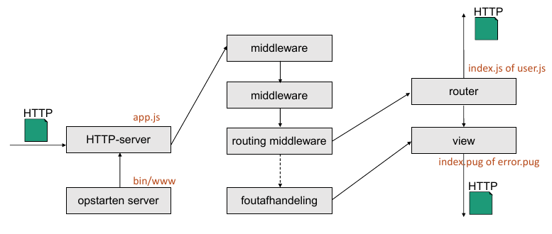

#### Demo

app.js

```js
let express = require('express') // Module
let path = require('path')
let logger = require('morgan')
let bodyParser = require('body-parser')

let routes = require('./routes/index')
let users = require('./routes/users')

let app = express()
//Views
app.set('views', path.join(__dirname, 'views'))
app.set('view engine', 'pug')
// Middleware
app.use(logger('dev'))
app.use(bodyParser.json())
app.use(bodyParser.urlencoded({ extended: false }))
// Routes
app.use('/', routes);
app.use('/users', users);

// error handler
app.use( (err, req, res, next) => {
  res.locals.message = err.message;
  res.locals.error =
  req.app.get('env') === 'development' ? err : {};
  res.status(err.status || 500);
  res.render('error');
});

module.exports = app;
```

routes/index.js

```java
let express = require('express');
let router = express.Router();

router.get('/', (req, res, next) => {
  res.render('index', { title: 'Express' });
});

module.exports = router;
```

---

## 4. Websockets

**Websocket**
: Websockets is a communication protocol that provides full-duplex, persistent, communication channels over a single, long-lived TCP connection. It's designed to enable real-time communication between a client, typically a web browser, and a server.

WS client example:

```js
let ws = new WebSocket("ws://www.websockets.org")

// Open connection
ws.addEventListener('open', (event) => { ws.send("Hello server!") })
// Listen for incoming messages
ws.addEventListener('message', (event) => { console.log(event.data) })
// Send a message
ws.send("Hello")
// Server closes connection
ws.addEventListener('close', (event) => { alert("closed") })
// Client closes connection
ws.close()
```

Before websockets, clients used `polling` to achieve the same functionality.
Websockets, however, have less latency  and less overhead which makes the way more efficient.

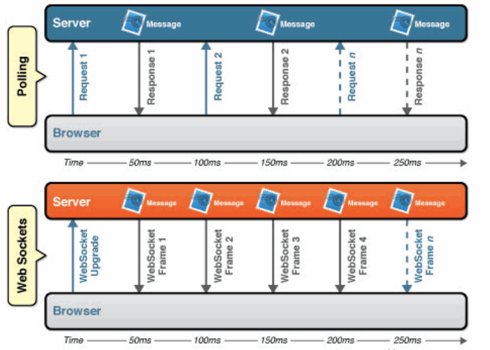

---

## 5. Reactive REST webservices

**Reactive programming**
: programming paradigm focused on building asynchronous and event-driven applications. At its core, reactive programming revolves around the idea of handling data flows and sequences of events with a focus on reacting to changes.

### 5.1  Data streams

Streams allow for requested data to be send as it comes. Parts of the data can already be send while other parts have not been loaded into memory yet. This is done by creating a  **pipeline** that subscribes to any incoming data, processes the data, and then publishes it.

Traditional methods required the application to store requests in memory. If the size of the required data is larger than the available memory, an "out of memory" error will occur.

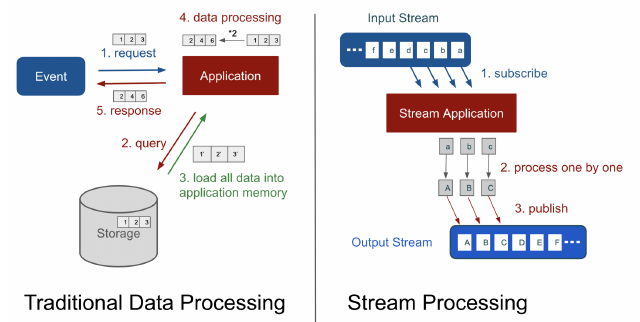

### 5.2 Observer and observables

Central to reactive programming are observables (or streams) that emit/push values or events and observers (or subscribers) that react to these emissions. Observers can subscribe to observables to receive and handle emitted values asynchronously.

**Backpressure**
: When a data provider pushes more data to a client than it can handle. This problem is solved by making the client pull available data, so it can decide on how fast it receives data.

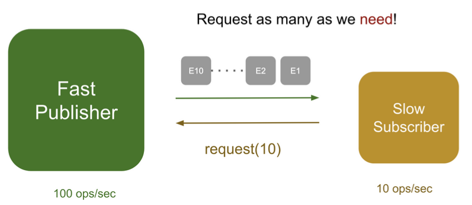

### 5.3 Reactor Java

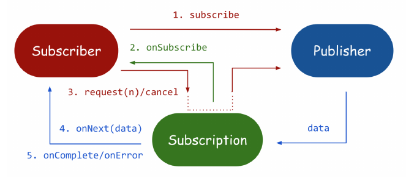

To efficiently program reactive applications, the [reactor](https://projectreactor.io/) library is often used.

#### Reactor - Flux

A `Flux` is used to emit multiple values (asynchronously) over time.

#### Reactor - Mono

A `Mono` is a kind of flux that can send only one element or none at all.

#### Reactive stack vs Servlet stack

| Reactive Stack | Servlet Stack |
|----------------|---------------|
| Spring security reactive | Spring Security |
| Spring WebFlux | Spring MVC |
| Spring reactive repos: Mongo, Redis, ...| Spring data repos: JDBC, JPA, NoSQL |

#### Example

Reactive DAO

```java
@Service
public class SampleDAO{
  final Random random = new Random();
    String[] ids = {"S1", "S2", "S3"};
  }

  public Flux<Sample> getSamples() {
    return Flux.interval(Duration.ofSeconds(1)).take(10)
      .map(pulse -> getSample());
  }

  private Sample getSample() {
    Sample s = new Sample();
    s.setId(ids[random.nextInt(ids.length)]);
    s.setTime(LocalDateTime.now());
    s.setValue(4882.42);
    return s;
  }
}
```

Reactive controller

```java
@RestController
@RequestMapping("samples")
public class SampleController {
  private SampleDAO dao;

  public SampleController(SampleDAO dao) { this.dao = dao; }

  @GetMapping("sample")
  public Flux<Sample> getSamples() { return dao.getSamples(); }
}
```

Reactive client

```java
public class ClientTestWebflux {
  public void testServer() {
    WebClient client = WebClient.create("http://localhost:8080");
    Flux<Sample> sampleFlux = client.get()
      .uri("/samples")
      .retrieve()
      .bodyToFlux(Sample.class);
    sampleFlux.subscribe(System.out::println);
    System.out.println("in test webflux");
  }
}
```

---

## 6. JDBC

**JDBC (Java Database Connectivity API)**
: An API that allows Java applications to interact with databases.

- Accesses SQL-compatible relational databases from Java application
- Can perform SQL-queries and process data
- Abstraction for common database functions
- Same application should work on different databases (no need to rewrite backend)

### 6.1 JDBC drivers

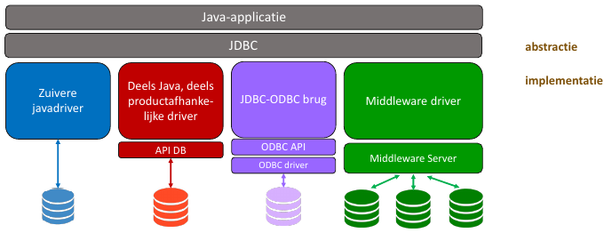

### 6.2 JDBC Example

#### Configuration

db_constants.properties

```text
# info databank
username=TLuca
password=<redacted>
driver=org.postgresql.Driver
connectionstring=jdbc:postgresql://localhost:5432/db_name

#Constanten for table products
Q_select_products=select * from products
Q_select_product=select * from products where productCode = ?

# Mappings to column names
prod_code=productCode
prod_name=productName
prod_price=buyPrice
prod_msrp=MSRP
```

#### Making connection

```java
@Component
@PropertySource("classpath:databankconstanten.properties")
public class JDBCDataStorage implements IDataStorage {
  @Value("${connectionstring}")
  private String connString;
  @Value("${username}")
  private String login;
  @Value("${password}")
  private String password;

  // Columns
  @Value("${prod_code}")
  private String prodCode;
  @Value("${prod_name}")
  private String prodName;
  @Value("${prod_price}")
  private String prodPrice;
  @Value("${prod_msrp}")
  private String prodMsrp;

  // SQL-queries
  @Value("${Q_select_products}")
  private String selectProducts;

  private DataSource dataSource;

  @Autowired
  public void setDataSource(DataSource dataSource) {
      this.dataSource = dataSource;
  }

  private Connection openConnectie() throws SQLException {
      return dataSource.getConnection();
  }
}
```

#### Performing actions (GET) on database

```java
public List<IProduct> getProducts() throws DataException { // DataException is custom class
  List<IProduct> products;

  try (Connection conn = openConnectie(); Statement stmt = conn.createStatement()) {
    System.out.println(conn.getClass());
    System.out.println(stmt.getClass());
    ResultSet rs = stmt.executeQuery(selectProducts);
    System.out.println(rs.getClass());
    products = new ArrayList<>();
    while (rs.next()) {
      products.add(createProduct(rs));
    }
  } catch (SQLException ex) {
    throw new DataExceptie(foutProducts);
  }
  return products;
}
```

### 6.3 SQL-injection

When using prepared statements, we possibly expose the application to SQL-injection.
We can defend ourself against this vulnerability by working with parameters:

```java
String username = getUserInput();
String sql = "SELECT * FROM users WHERE username = ?";
PreparedStatement preparedStatement = connection.prepareStatement(sql);
preparedStatement.setString(1, username);
ResultSet resultSet = preparedStatement.executeQuery();
```

### 6.4 Driver vs DataSource

**DataSource**:

- Spring
- Represents a DBMS
- Available through dependency injection or JNDI
- Safer than driver: No configuration in code.

### 6.5 ORM vs JDBC

- JDBC/ADO.NET:
  - Time-intensive
  - Low-level data-access
- ORM
  - Defining a mapping with annotations
  - Less performant
  - Faster dev time

---

## 7. ADO.NET

To get access from .NET-application to datasource (database, xml, ...).

- Loose coupling between application and datasource: Perform data manipulations on a part of the data without immediately applying these changes to the datasource.
- Easy to convert to XML

### 7.1 ADO.NET Architecture

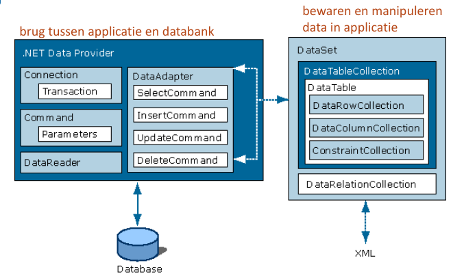

### 7.2 DataSet

A `DataSet` is a collection of data tables that contain the data. It is used to fetch data without interacting with a Data Source. It is an in-memory data store that can hold more than one table at the same time.

#### Creating a DataSet

```csharp
// Creating a DataSet
DataSet ds = new DataSet();
DataSet customerDS = new DataSet("CustomerOrders");

// Creating a Table
DataTable orders = customerDS.Tables.Add("Orders");

// Creating column
DataColumn orderId = orders.Comumns.Add("OrderID", typeof(Int32));

// Key constraint
orders.PrimaryKey = new DataColumn[] {orderId};

// Adding data to rows
DataRow rowOrders = orders.NewRow();
rowOrders[bestelID] = 3;
rowOrders["Quantity"] = 9;
orders.Rows.Add(rowOrders);
```

### 7.3 DataProvider

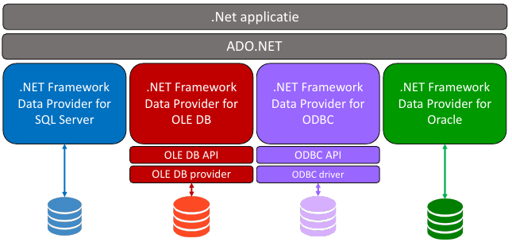

#### Key objects

- `Connection`: Connect to DB
- `Command`: Perform a command
- `DataReader`: Obtain data
- `DataAdapter`: Connect DataSet with DB

### 7.4 Data Manipulation

OrdersDAOReader.cs

```csharp
// Configuration
String task = ConfigurtionManager.AppSettings["SELECT_ORDER"];
ConnectionStringSettings connStringSet = ConfigurationManager.ConnectionString["orders"];

// Factory for provider
DbProviderFactory factory = DbProviderFactory.GetFactory(connStringSet.ProviderName);

// Connection object
DbConnection conn = factory.CreateConnection();
DbCommand command = conn.CreateCommand();

command.CommandText = Configuration.AppSettings["SELECT_ORDERS"]

// Run command-objects
using (DbConnection conn = ...) {
  conn.Open()
  // delete-, insert-, update queries
  int rowsChanged = command.ExecuteNonQuery();
  // select queries
  DbDataReader reader = command.ExecuteReader();
  while (reader.Read()) {
    DataRow row = tableOrder.NewRow();
    row[0] = reader["orderID"];
    row[1] = reader[1];
    row[2] = reader.GetString(2);
    tabelOrder.Rows.Add(row);
  }
}
```

App.config

```xml
<configuration>
  <connectionStrings>
    <add name="orders" providerName="System.Data.SqlClient" 
      connectionString="Data Source=(LocalDB)\MSSQLLocalDB"/>
  </connectionStrings>
  <appSettings>
    <add key="SELECT_ORDER" value="select * from Orders"/>
  </appSettings>
</configuration> 
```

### 7.5 DataAdapter

The adapter can add data to the `DataTable`, and write those changes to the DB. Before, the changes in `DataTable` where not definitive.

`DataAdapter` has 4 Command-objects:

- `SelectCommand`: Retrieves data from the database based on specified criteria, usually in the form of a SELECT query
- `InsertCommand`: Inserts new data into the database. It typically includes an INSERT query
- `UpdateCommand`: Modifies existing data in the database. (Write changes made to `DataSource` to DB)
- `DeleteCommand`: Removes data from the database

OrderDAOAddapter.cs

```csharp
DbDataAdapter adapter = factory.CreateDataAdapter();
DbCommand command = ...;
adapter.SelectCommand = ...;
DataSet customerDS = new DataSet(DS_ORDERS);
adapter.Fill(customerDS, TABLE_ORDERS);
```

### 7.6 Transactions

1. Start transaction
2. Assigning a Transaction-obj to a Commmand-obj
3. Running the queries
4. Commit - Rollback

```csharp
using (DbConnection conn = ...) {
  conn.Open();
 
  // Basic transaction
  using (DbTransaction trans = conn.BeginTransaction())
  {
    try
    {
      // Perform database operations within the transaction

      // Commit the transaction
      trans.Commit();
    } catch (Exception) {
      // Rollback the transaction if an exception occurs
      trans.Rollback();
    }
  }
}
```

---

## 8. REST-services in .NET

### 8.1 Web API

The .NET alternative to the Spring framework for REST-services is ASP.NET.
It makes it possible to easily create a HTTP service that exposes  an application's functionality and data as services over the internet using standard HTTP methods (GET, POST, PUT, DELETE, etc.) and data formats like JSON or XML.

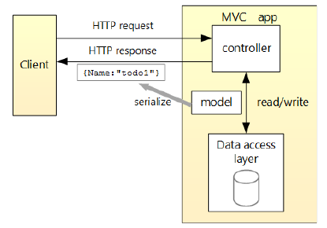

#### Example

Controllers/PrimateController.cs

```csharp
[Route("api/ape_species")]
[ApiController]
public class PrimateController : ControllerBase {

  private readonly PrimateContext _context;

  public PrimateController(PrimateSpeciesContext ctx) {
    _context = ctx;
    if(_context.PrimateSpecies.Count() == 0) {
      _context.PrimateSpecies.Add(new PrimateSpecies { Name = "Black Spider Monkey"});
      _context.SaveChanges();
    }
  }
  
  [HttpGet]
  public IEnumerable<string> Get() {...}
  
  [HttpGet("{id}")]
  public async Task<ActionResult<PrimateSpecies> GetSpeciesById(long id) {
    var species = await _context.PrimateSpeciesCollection.FindAsync(id);
    if (species == null) { return NotFound(); }
    return species;
  }

  [HttpPost]
  public async Task<ActionResult<PrimateSpecies>> PostPrimate(PrimateSpecies species) {
    _context.PrimateSpeciesCollection.Add(species);
    await _context.SaveChangesAsync();
    return CreatedAtAction("GetSpeciesById", new { id = species.Id}, species);
  }
  
  [HttpDelete("{id}")]
  public async Task<ActionResult<PrimateSpecies>> DeletePrimateSpecies(long id) {
    var species = await _context.PrimateSpeciesCollection.FindAsync(id);
    if (species == null) { return NotFound(); }
    _context.SapienSpeciesCollection.Remove(species);
    await _context.SaveChangesAsync();
    return species;
  }
}
```

Modes/DbContext.cs

```csharp
public class PrimateSpeciesContext: DbContext {
  public PrimateSpeciesContext(DbContextOptions<PrimateSpeciesContext> options) : base(options) { }

  public DbSet<PrimateSpecies> SapienSpeciesCollection { get; set; }
}
```

Models/PrimateSpecies.cs

```csharp
nanespace vbWebAPI.Models {
  public class PrimateSpecies {
    public long Id { get; set; }
    [Required]
    public string Name {get; set; }
    [DefaultValue(false)]
    public bool IsComplete { get; set; }
  }
}
```

### 8.2 OpenAPI specification

- Format to describe a REST-webservice
  - Info: licence, contact, ...
  - Servers: Which URL's are available
  - Security: Which security mechanisms are implemented
  - Pahts: The different endpoints (+ Methods)
  - Tags: to group paths
  - ExternalDocs: reference to docs
- In JSON or YAML

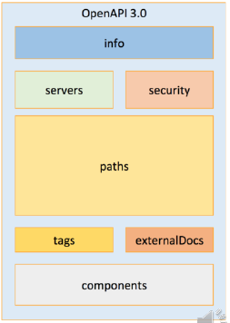

#### Swagger

JSON is easy to automatically generate JSON using [swagger.io](https://swagger.io/).

> 💡: Swagger can also interpret comments in code like `javadocs`

---

## 9. ASP.NET Core MVC

### Model-View-Controller-pattern (MVC)

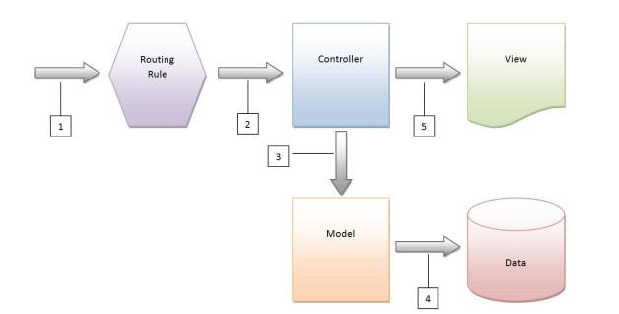

MVC's aim to separate concerns within an application by dividing it into three interconnected components:

1. **Model**: data and business logic
2. **View**: Presentation layer (UI)
3. **Controller**: intermediary between the Model and the View. It handles user input and translates it into actions performed by the Model or View

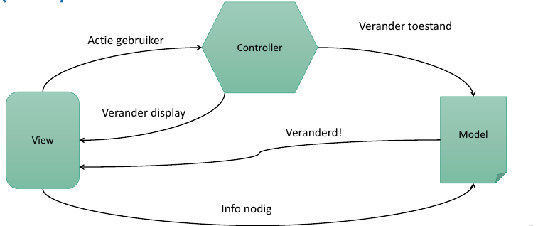

Structure:

```text
Application
  ┣━ /Controllers/
  ┃   ┗ ProductController.cs
  ┣━ /Models/
  ┃   ┗ ProductModel.cs
  ┣━ /Views/
  ┃   ┗ /Product/
  ┃       ┣ Index.cshtml
  ┃       ┗ Details.cshtml
  ┗━ Program.cs
```

#### Model

```csharp
// Product model class representing the data structure
public class Product
{
    public int Id { get; set; }

    [Display(Name = "Name")]
    [Required(ErrorMessage = "Name can not be empty.")]
    public string Name { get; set; }
    public decimal Price { get; set; }
}
```

#### View

- `View()`: Opens view with name matching the method
- `View("String")`: Opens view `string.cshtml`
- `View(Object)`: proved Object to view called `<methodname>.cshtml`
- `View("string", Object)`: provide Object to view called `string.cshtml`

```csharp
@model List<Product>
<ul>
    @foreach (var product in Model)
    {
        <li>@product.Name - $@product.Price</li>
    }
</ul>
```

#### Controller

1. Provides Views
2. Handle errors during action
3. `IActionResult` return the View that matches the method name, but can also:
    - Render a partial view (view within another view)
    - Redirect to other method
    - Return JavaScript to execute
    - ...
4. Can also pass data to View
5. Can handle request from client (using HTTP-methods + parameters)

```csharp
public class ProductController : Controller
{
    public IActionResult Index()
    {
        // Simulated data retrieval
        var products = new List<Product>
        {
            new Product { Id = 1, Name = "Product A", Price = 19.99M },
            new Product { Id = 2, Name = "Product B", Price = 29.99M },
            new Product { Id = 3, Name = "Product C", Price = 39.99M }
        };

        return View(products); // Pass the list of products to the view
    }

    // /Product/Detail/{id}
    public IActionResult Details(int id)
    {
        return View(id);
    }

    // /Product/Details?id={id}
    public IActionResult Details() {
        return View(Convert.ToInt32(Request["id"]));
    }
}
```

#### Routing

Program.cs:

```csharp
app.MapControllerRoute(name: "blog",
  pattern: "blog/{*article}",
  defaults: new { controller = "Blog", action = "Article" });
app.MapControllerRoute(name: "default",
  pattern: "{controller=Home}/{action=Index}/{id?}");
```

> ⚠️: It's also important that the app is protected against XSRF/CSRF (Cross-site request forgery): attacker exploits a user's authenticated session to execute malicious actions. To prevent this, tokens or verification techniques are used to confirm the authenticity of requests, ensuring they originate from the expected user.

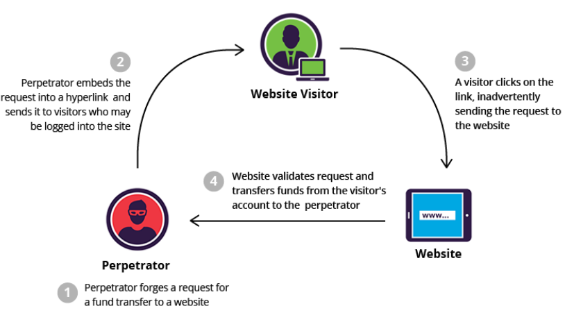

### Globalization and Localization

**Globalization**
: Application should support multiple languages and cultures (eg: display Arabic characters)

**Localization**
: Change application to a specific language or culture

1. Make content changeable
2. Provide content per language / culture (XML files with different language, decision on which language to use can be done with middleware)
3. Select language / culture

### Security

#### Authentication

```csharp
// Only add storage if user had valid identity
builder.Services.AddDefaultIdentity<IdentityUser>(options =>
  options.SignIn.RequireConfirmedAccount = true)
  .AddEntityFrameworkStores<ApplicationDbContext>();

...
app.UseAuthentication();
app.UseAuthorization();
```

#### Authorization

```csharp
public class AccountController : Controller {
  [AllowAnonymous] // Allow anyone
  public ActionResult Login(){ }
  [Authorize] // Allow only to authorized users
  public ActionResult Logout(){ }
  [Authorize(Roles = "Administrator")]
  public ActionResult AdminPanel() {}
}
```

---

## 10. Security

### 10.1 Authentication

- "Recognizing" users
- Provide login for users

#### Cookie-based auth -> Sessions

1. Client logs in
2. Browser sends login details to server
3. Server adds cookie with session-id in header
4. Client includes cookie in header with every request it makes
5. Sever saves info about client (session-object)

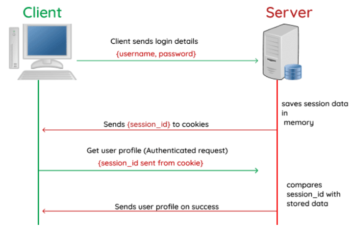

- ✅: Login only once
- ✅: Validity of cookie can get disabled
- ❌: Only valid for one domain
- ❌: Vulnerable for XSS- and XSRF attacks
- ❌: Not *stateless*: temporary save user info on server

#### Token-based auth

1. Client logs in
2. Browser sends login details to server
3. Server makes token
4. Token gets saved in browser memory
5. Client provides token in every request in Auth-header
6. Server decodes token and verifies credentials

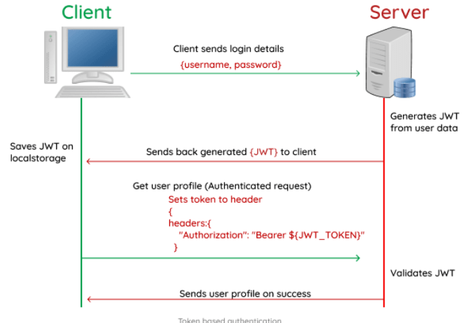

- ✅: Stateless -> Token contains all info to get verified, no copy on server needed
- ✅: Valid on multiple domains
- ✅: No userinfo in token
- ✅: Not vulnerable for XSRF attacks
- ❌: Validity of token can not be revoked
- ❌: Vulnerable for XSS attacks

#### OAuth2

**OAuth2**
: authorization framework that enables third-party applications to access certain resources on behalf of a user, without necessarily sharing the user's credentials. It's commonly used for delegated access, allowing applications to act on behalf of users to access their data on different services.

**Parties:**

1. **Resource Owner**: End user, owner of the data
2. **Client**: Application that wants to access user's data (eg: Spotify)
3. **Authorization Server**: Manages authorization and authentication, issues access tokens (eg: Facebook Auth server)
4. **Resource Server**: Holds protected resources that client wants to access (eg: facebook.com)

**Flow**:

1. **Authorization Request**:
    - The client requests authorization from the resource owner to access its resources.
    - This request is redirected to the authorization server.
2. **User Authorization**: Resource owner grants consent to log in to auth server
3. **Authorization Grant**: Auth server sends back authorization grant and auth code back to client.
4. **Access Token Request**: Client request *access token* form auth server by presenting it with its auth grant and auth code.
5. **Access Token Grant**: If the authorization server verifies the client and authorization grant, it issues an access token to the client.
6. **Accessing Protected resources**:
    - Client requests resources from resource server (eg: profile picture and friends)
    - Client includes token in header

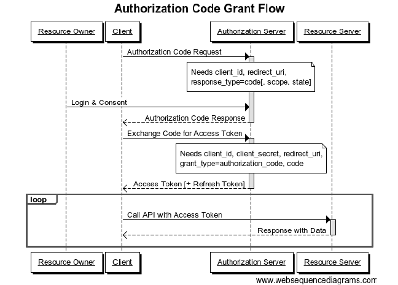

**Types of Grants**:

- Authorization Code: when client is a webserver
- Implicit: when client is a js-app in browser
- Resource owner password credential: when client and auth server are from same authority
- Client credentials: when client is the resource owner

**OAuth vulnerabilities**:

- ❌: Access token is available in js in browser
- ❌: Attacker can make ordinary service (client) that requires OAuth signup -> uses obtained token to get access to other resource servers that use same OAuth service
- ✅: Solution -> auth server provides additional information about token (check if proper client = **Proof Key for Code Exchange**)

#### Single Sign On (SSO)

- Login once for different webapps
- Single point of failure
- Can be implemented with OAuth or SAML

#### Two Factor Authentication (2FA)

Authentication involves multiple steps. Possible over multiple devices.

### 10.2 Most common vulnerabilities

#### 1. Injection

The injection of SQL into ordinary input fields/parameters (XSS)

#### 2. Id and Authentication failures

Bad implementation of authentication and session management. Attacker gets access to passwords, keys or session tokens.

#### 3. Cryptographic Failures

Sensitive data not sufficiently protected because of bad or old cryptography implementation.

> 💡: Use existing, well respected frameworks to implement cryptography.

#### 4. Insecure design

Bad design, not tested against common vulnerabilities.

#### 5. Broken Access Control

Users have to many access rights (attacker gets right to other accounts, files, databases, ...)

#### 6. Security Misconfiguration

- Outdated software
- Unsafe default configuration (default passwords)

#### 7. Server-Side request forgery (SSRF)

Using an insecure server to gain access to intern data (eg: urls as parameter in response).

#### 8. Software and Data Integrity Failures

Using libraries of untrusted sources, or having an unsafe CI/CD pipeline.

#### 9. Vulnerable and outdated components

Newer version often contain patches for 0-days.


