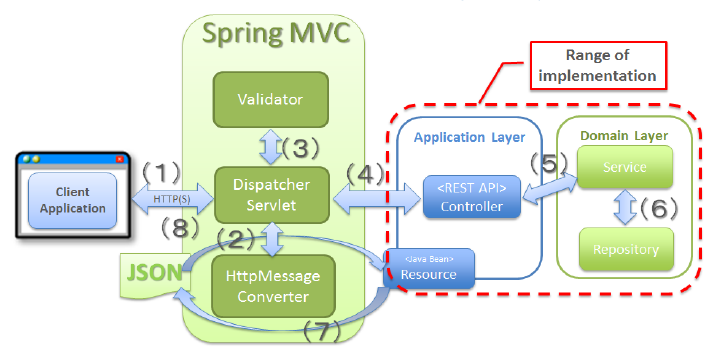
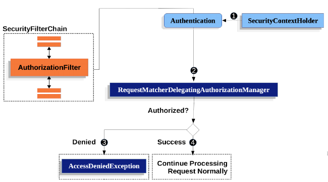

# Frameworks summary

## 1. REST

### 1.1 HTTP refresher

- Client-server protocol
- Transport protocol: TCP on port 80
- Request-response

#### HTTP Request

Request types:

- GET
- POST
- PUT
- DELETE
- HEAD
- OPTIONS

Statuscodes:

- 1xx: Informative
- 2xx: Success
- 3xx: Redirection
- 4xx: Client error
- 5xx: Server error

### 1.2 Rest webservices

REST stands for Representational State Transfer. It's an architectural style used for designing networked applications, especially web services. REST relies on a client-server architecture where the client interacts with the server via requests to access and manipulate resources on the server

- **Client-server**
- **Stateless**: server doesn't store any client context
- **Uniform interface**: independent of type of client 
- **Cacheable**: responses from REST service can specify to cache for a specified period. (using the `Cache-Control` header field)
- **Layered system**: client doesn't now which layer it is connected to
- **Code on demand**: Content of message can also be code
- Resource-based: can be any data or service that the app exposes, resources is identifiable via a URI
- CRUD operations: Must support GET, POST, PUT, DELETE methods.
- Representational resources: could be represented by multiple representations (JSON, XML, ...)


#### URI (Uniform Resource Identifier)

URI's are hierarchical structures that represent a resource on which CRUD actions can be performed.

hierarchical: `http://www.myservice.org/discussions/{year}/{day}/{month}/{topic}`

It is also possible to add parameters to the URI to filter or sort on a resources: `http://www.myservice.org/discussions?region=USA&year=2023`

#### Glory of REST


##### Level 0: The swamp of pox

- One endpoint
- HTTP only as transport
- Remote procedure invocation (`POST <openSlotRequest`)

##### Level 1: Resources

- Multiple endpoints
- Arguments in body (`POST <appointmentRequest`)

##### Level 2: HTTP-methods

- HTTP-methods as CRUD  (`GET ?date=20231224`)
- HTTP-statuscodes as response (`200 OK <openSlotList`)

##### Level 3: Hypermedia controls

- HATEOAS (Hypertext As The Engine Of Application State)
- Links to other resources in response
- Selfdocumenting protocol

### 1.3 Rest webservices: Java (*Springboot*)

**Why springboot?**

Spring avoids a lot of manual configuration and is easy to manage dependently.


#### Spring architecture



1. Spring-framework receives HTTP-req and determines which *method* of which *controller* has to get called.
2. (Opt) Convert JSON in body to specific object
3. (Opt) Validate input values of object
4. Call method of *controller* with object as param
5. *Controller* calls underlying logic
6. Logic interacts with data-layer
7. Result of *controller* gets serialized to JSON
8. HTTP-response gets generated (possibly with JSON-object in body)

#### GET controller

```java
import org.springframework.web.bind.annotation.*;

@RestController // Indicate that this class is a RestController
@RequestMapping("agenda") //The path to access agendas (eg: localhost:8080/agenda)
public class AgendaController {
  private Agenda agenda;
  pubic AgendaController(Agenda agenda) { this.agenda = agenda; }

  @GetMapping // Indicate that method handles Get-requests
  public Collection<AgendaItem> agendaFromNow() {
    return agenda.getAgendaItem(new Date());
  }
}
```

- `@RestController`:
  - Normal class
  - Wrapped in a `serverlet`
  - REST-service
- `@RequestMapping`:
  - Specifies which path a REST-service needs to handle.
- `@GetMapping`:
  - Specifies which HTTP-method a method response to
  - Result is automatically converted to JSON
  - Can have a path as parameter (eg `GetMapping("/id/{id}")`)
    - Param can be retrieved using `@RequestParam("id")`
- `@PostMapping`:
  - Body can be retrieved using `@RequestBody AgendaItem item`

##### Dependency injection

DI is needed to make the Agenda class (dependency) available to the to `RestController`. 

```java
@Component
public class Agenda {...}
```

##### Method response status


A REST-method typically returns a `ResponseEntity` (along with a message).

```java
@GetMapping("/age")
ResponseEntity<String> age(@RequestParam("yearOfBirth") int yearOfBirth) {
  if (invalidAge(yearOfBirth)) {
    return new ResponseEntity<>("Invalid year of birth", HttpStatus.BAD_REQUEST);
  }
  return new ResponseEntity<>("YOB is " + yearOfBirth, HttpStatus.OK);
}
```

It is also possible to couple a statuscode to an exception:

```java
@ResponseStatus(code = HttpStatus.BAD_REQUEST)
class CustomException extends RuntimeException {}
```

```java
@PostMapping()
@ResponseStatus(HttpStatus.CREATED)
public void storeEmployee(@RequestBody Employee employee) {...}
```

Here the `ResponseStatus` will automatically return a 201 if the creation of employee was successful.

Finally it is also common to respond with a URI.

```java
@PostMapping("/user/{username}")
public ResponseEntity<Void> createTodo(@PathVariable String username, @RequestBody Todo todo) {
  todo.setUsername(username);
  Todo createdTodo = toJpaRepo.save(todo);
  URI uri = ServletUriComponentsBuilder.fromCurrentRequest()
              .path("/id").buildAndExpand(createdTodo.getId()).toUri();
  return ResponseEntity.created(uri).build();
}
```

### 1.4 Testing webservices

#### Unit tests (Junit)

**Fixture**:

- Fixed context
- baseline state

Four phases:

1. Setup: Prepare text fixture
2. Exercise: Interact with system to research
3. Verify: Verify if it behaves as expected
4. Tear down: Break down text fixture to original state

```java
@ExtendWith(SpringExtension.class)
@SpringBootTest(webEnvironment = WebEnvironment.RANDOM_PORT)
@AutoConfigureWebTestClient
@ActiveProfile("test")
class RestAgendaApplicationTest {
  @Autowired
  private WebTestClient webClient;

  @Test
  public void testGetAllRepos() {
    WebTestClient.get().uri("/api/repos")
      .accept(MediaType.APPLICATION_JSON_UTF8)  // Set header
      .exchange()                               // Send message
      .expectStatus().isOk()                    // Check status
      .expectHeader().contentType(MediaType.APPLICATION_JSON_UTF8) // Check header
      .expectedBodyList(Repo.class)             // Check body
  }
}
```

The `@ActiveProfile` annotation is optional but is very useful. It let's us use a different bean configured specifically for testing purposes.

```java
@Component
@Profile("test")
public class DummyDao implements Dao {...}
```

### 1.5 Webservices security

#### Authentication

Configure login information

```java
@Configuration
@EnableWebSecurity
public class SecurityConfig {
  @Bean
  public UserDetailsService userDetailsService(BCryptPasswordEncoder bCryptPasswordEncoder) {
    InMemoryUserDetailsManager manager = new InMemoryUserDetailsManager();
    manager.createUser(User.withUsername("user")
      .password(bCryptPasswordEncoder.encode("userPass"))
      .roles("USER")
      .build());
    manager.createUser(User.withUsername("admin")
      .password(bCryptPasswordEncoder.encode("adminPass"))
      .roles("USER", "ADMIN")
      .build());
    return manager;
  }
...
}
```

#### Authorization

Assign roles to users and restrict certain roles from performing certain actions.



**Allow certain roles webservice:** (`anyRequest()`)

**Allow certain roles on some paths:** (`requestMatchers(path)`)

```java
@Configuration
@EnableWebSecurity
public class SecurityConfig {
  @Bean
  public SecurityFilterChain securityFilterChain(HttpSecurity http) throws Exception {
    http
      .authorizeHttpRequests((authz) -> authz
        .requestMatchers("/api/admin/**").hasRole("ADMIN")
        .requestMatchers("/api/user/**").hasRole("USER")
        .anyRequest().authenticated()
      );
    return http.build();
  }
...
}
```

**Allow certain roles on some webservice methods:** (`@EnableMethodSecurity()`)

```java
@Configuration
@EnableMethodSecurity(prePostEnabled = true, securedEnabled = true, jsr250Enabled = true)
public class SecurityConfig {
  @RolesAllowed("ROLE_VIEWER")
  public String getUser();

  @RolesAllowed({ "ROLE_ADMIN", "ROLE_EDITOR" })
  public void deleteUser();
}
```

#### CSRF: Cross Site Request Forgery

CSRF is an attack where an attacker tricks a user's browser into making an unintended and unauthorized request to a different website, exploiting the user's authenticated session.

**How to defend against CSRF?**

Make distinction between real and fake HTTP-request by using a **Synchronizer Token Pattern** or **SameSite-attribute cookie**.

Both methods generate a token for the client on login. Then every time the client interacts with the server, the client includes that token in its request.
On every request, the server will validate if it received a valid token. These tokens have a certain expiration date to avoid problems upon token theft.

> 💡: In Spring, CSRF security is enabled by default.

---

